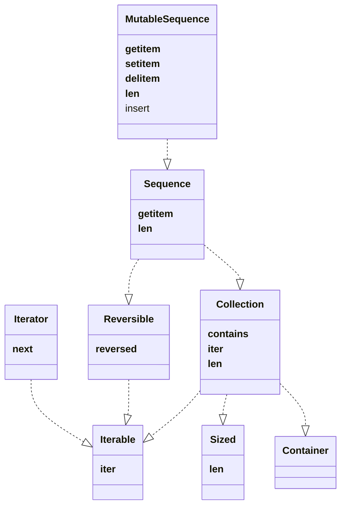
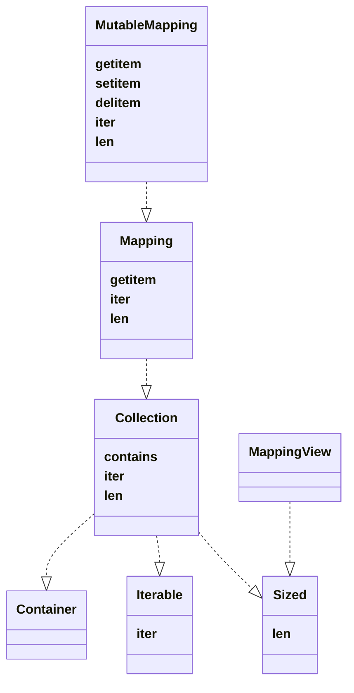
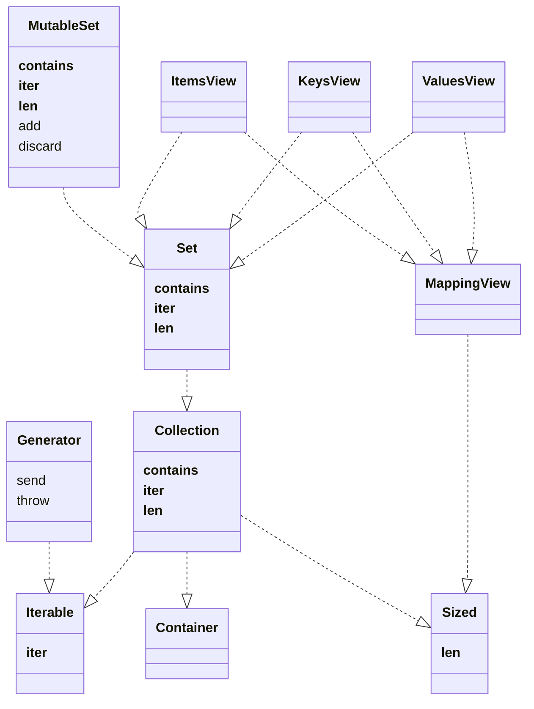
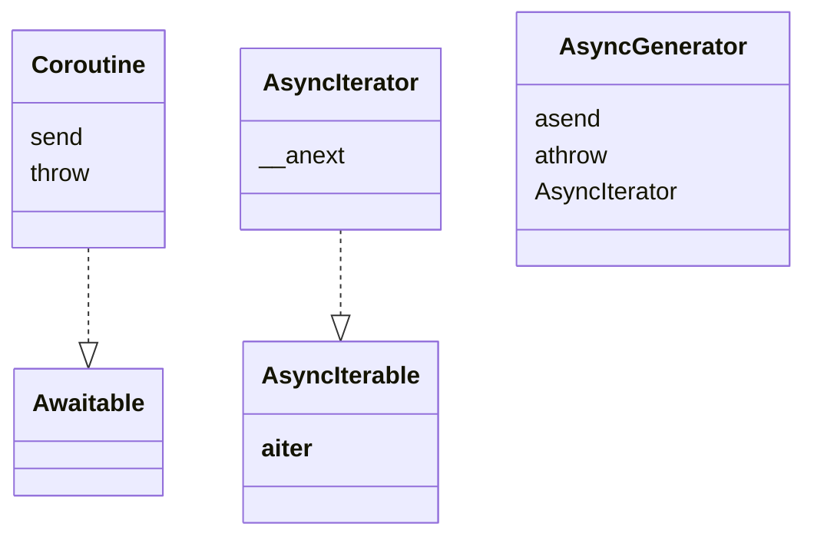
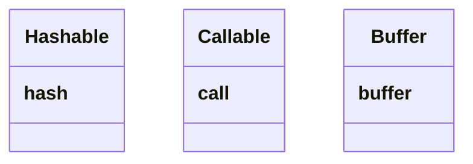

# Python Collection Types for Typehinting

I've split the collection structure into these segments

- linear types : list-like collections. Use `Sequence` or `MutableSequence`
- mapping types : key-value collections. Use `Mapping` or `MutableMapping`
- nonlinear types : unordered collections. Use `Set` or `MutableSet`. For generators, it's `Generator[YieldT]`[^1].
- async types : async-coloured collections
- other types : other things

## Linear Types

The linear types are list-like. If you want to manipulate the collection, you will probably want `Sequence` (which includes `tuple` and `list`) or `MutableSequence`. If all you need is to traverse it, use `Iterable`

Instead of using `TupleOf = tuple[T, ...]`, use `Sequence[T]`.

## Mapping Types

Mapping types are key-value pairs, or something like that. Use `Mapping` or `MutableMapping`, which includes `dict` and
several relatives.

## Nonlinear Types

These collections have unordered membership, but are not associated with values. This does not extend to other semantics of `set`. For example, a `KeysView` can have duplicates, although `set` does not. You are probably not interested in MappingView.

## Async Types

## Other Types

If you think about it, a mapping is a function that turns keys into values. So a `Callable` is sortof a mapping type.

[^1]: The full signature is `Generator[YieldType, SendType, ReturnType]`, but `SendType` and `ReturnType` default to `None` so you can just use `Generator[YieldType]`. You can also just use `Iterator[YieldType]`. You _could_ also use `Iterable[YieldType]`, but you might be confused that you can't start multiple `Iterators` of it (double-traversal will confuse everything).
